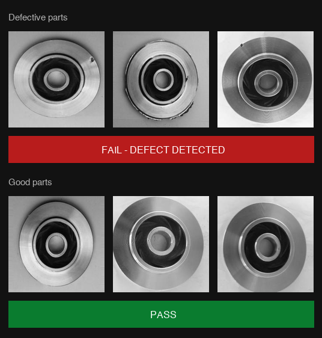

# Automated Casting Inspection — Demo for Twin City Die Castings

A computer-vision demo that classifies aluminum die castings as **defective** or **good** in real time, built as a portfolio project targeting Roboflow's SDR role.

**[Live demo →](https://casting-demo-app-ncrmxxeh394yibpnqjbjgy.streamlit.app)** &nbsp;|&nbsp; **[Roboflow Universe project →](https://universe.roboflow.com/dhruv-kothari-yrwsq/casting-defect-tcdc-demo)**

---

## Accuracy

| Metric | Result |
|---|---|
| Test-set accuracy | **100%** (130 / 130 images) |
| Defect recall (true positive rate) | **100%** (87 / 87 defective parts caught) |
| False positives | **0** |
| Test set composition | 87 defective, 43 good — held-out, never seen during training |

> Production environments are harder than this controlled public dataset — which is exactly what a pilot would quantify.

---

## App preview



The app displays a factory-floor-style **PASS / FAIL** verdict with confidence score for each image. A sidebar ROI calculator estimates annual savings from automated inspection based on your facility's defect rate and incident cost.

---

## How it was built

The dataset — ~1,300 grayscale images of aluminum pump impeller castings (sourced from Kaggle via Roboflow Universe) — was annotated and split into train / validation / test sets inside Roboflow. A ResNet-18 classification model was trained using Roboflow's hosted training in an afternoon, with no custom model code. Inference runs through Roboflow's serverless API: the app base64-encodes each image and POSTs it to the hosted endpoint, getting a `{"top": "defect"|"ok", "confidence": ...}` response back in ~25 ms. The Streamlit front-end, ROI calculator, and evaluation script (`evaluate.py`) were written in Python. The full held-out test set evaluation achieved 100% accuracy with zero missed defects.

---

## Repo structure

```
app.py            Streamlit demo application
evaluate.py       Batch evaluation script (produces confusion_matrix.png, results.csv)
requirements.txt  Python dependencies
samples/          Six sample images used in the app (3 defect, 3 good)
test-set/         130-image held-out test set (87 defect, 43 ok)
confusion_matrix.png  Evaluation output
results.csv       Per-image prediction log
```

---

*Built by Dhruv Kothari — portfolio demo for Roboflow SDR application*
